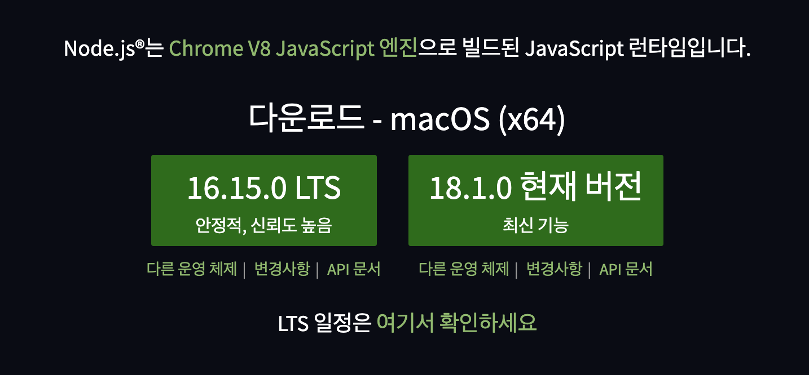
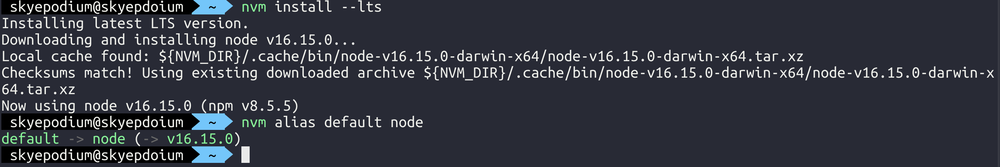

# 설치

> node.js 환경 부터 진행합니다.

### 1) 환경
타입 스크립트를 사용할때는 `LTS(Long Term Support) 버전`의 node.js를 사용하는것이 좋습니다.

2022.05.05의 LTS 버전은 `16.15.0` 입니다.    



### 2) node.js 버전 확인
```
node --version
```


### 3) nvm 설치
`NVM`은 Node Version Manager로 node.js 의 여러 버전을 사용할 수 있도록 도와주는 도구입니다. 

NVM을 설치하고, LTS 버전을 사용해봅시다.
```
node i -g nvm
```

### 4) node.js 버전 LTS 로 업그레이드
LTS 버전의 node.js 를 설치합니다.
```
nvm install --lts
```

현새 사용중인 LTS 버전을 기본값으로 사용합니다.

이 명령어를 수행하지 않으면 터미널을 새로 열때마다 이전 버전으로 돌아갑니다.
```
nvm alias default node
```


### 5) TypeScript 설치
```
npm i -D typescript
```

### 6) tsconfig.js
```json
{
    "compilerOptions" : {
      "target": "es6",
      "module": "commonjs",
    }
}
```

### 7) ts
```ts
const sum = (a:number, b: number): number => {
    return a + b
}

const res:number = sum(1, 2)

console.log('res', res)
```

### 8) 컴파일
`tsc`는 TypeScript compile의 약자입니다.

tsc로 컴파일하여 `.js`을 만들어줍니다.
```shell
tsc index.ts
```

### 9) 실행
```
node index.ts
```

### 10) ts-node
`ts-node` 는 1) tsc로 컴파일, 2) node 명령어로 실행하는 과정을 한번에 해줍니다.

개인적으로는 leetcode의 알고리즘 문제를 TypeScript로 풀때 편리하게 사용하고 있습니다.

- 설치
```
npm i ts-node
```

- 실행
```
ts-node index
```
