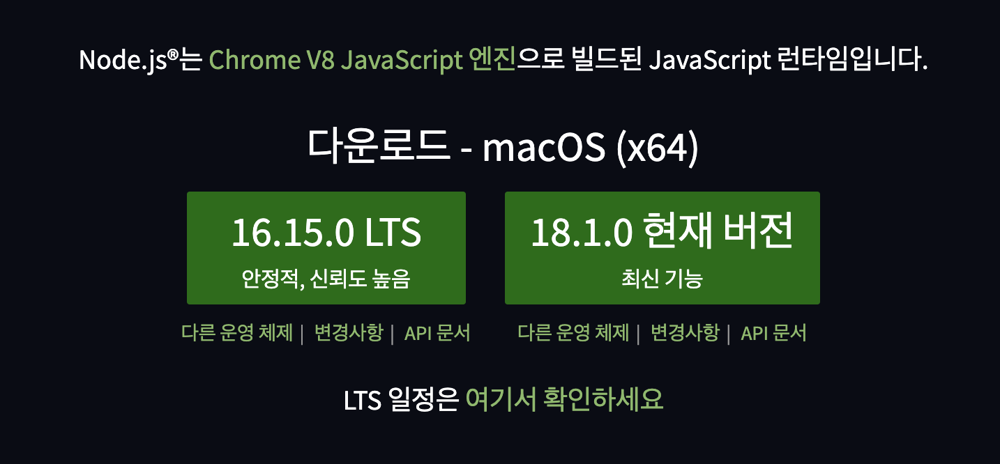
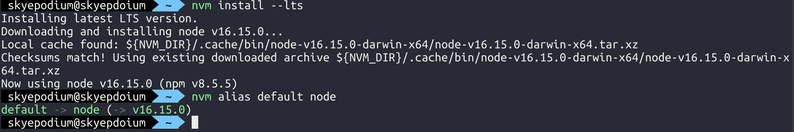

# node.js 설치

> node.js LTS 버전을 갖춰줍니다.

### 1) 환경
타입 스크립트를 사용할때는 `LTS(Long Term Support) 버전`의 node.js를 사용하는것이 좋습니다.

2022.05.05의 LTS 버전은 `16.15.0` 입니다.    



### 2) node.js 버전 확인
```
node --version
```


### 3) nvm 설치
`NVM`은 Node Version Manager로 node.js 의 여러 버전을 사용할 수 있도록 도와주는 도구입니다. 

NVM을 설치하고, LTS 버전을 사용해봅시다.
```
node i -g nvm
```

### 4) node.js 버전 LTS 로 업그레이드
LTS 버전의 node.js 를 설치합니다.
```
nvm install --lts
```

현새 사용중인 LTS 버전을 기본값으로 사용합니다.

이 명령어를 수행하지 않으면 터미널을 새로 열때마다 이전 버전으로 돌아갑니다.
```
nvm alias default node
```


