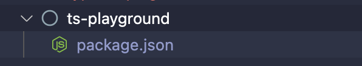

# 타입 스크립트 환경 설정

### 1) 빈 폴더 생성
사용할 폴더를 만들고 이동합니다.
```
mkdir ts-playground

cd ts-playground
```

### 2) npm init
현재 폴더를 npm 패키지로 생성합니다. 
```
npm init
```

`npm init` 명령어를 수행하면 `package.json` 파일이 생성됩니다.




### 3) TypeScript 설치
외부 라이브러리는 크게 2가지로 나누어집니다. `1) dependencies, 2) devDependencies` 
개발할때만 사용하고, 실제 서비스할 때는 사용되지 않는 라이브러리들은 `devDependencies`에 포함됩니다.

타입스크립트 또한 `devDependencies` 라이브러리입니다. 따라서, `-D` 옵션을 사용해서 설치합니다. 

```
npm i -D typescript
```

package.json 파일의 `devDependencies` 항목에 `typescript`가 추가되었습니다.
```json
{
  "name": "ts-playground",
  "version": "1.0.0",
  "description": "",
  "main": "index.js",
  "scripts": {
    "test": "echo \"Error: no test specified\" && exit 1"
  },
  "author": "",
  "license": "ISC",
  "devDependencies": {
    "typescript": "^4.6.4"
  }
}
```

### 4) tsconfig.js
`tsconfig.js`는 타입스크립트 환경을 위한 파일입니다. 루트에 `tsconfig.js`를 생성해줍니다.
```json
{
    "compilerOptions" : {
      "target": "es6",
      "module": "commonjs",
    }
}
```

### 5) .ts 파일 작성
두개의 숫자를 받고 합을 반환하는 함수를 만들어줍니다.
```ts
// index.ts
const sum = (a:number, b: number): number => {
    return a + b
}

const res:number = sum(1, 2)

console.log('res', res)
```

### 6) 컴파일
`tsc`는 TypeScript compile의 약자입니다.

tsc로 컴파일하여 `.js`을 만들어줍니다.
```shell
tsc index.ts
```

### 7) 실행
```
node index.ts
```

### 8) ts-node
`ts-node` 는 1) tsc로 컴파일, 2) node 명령어로 실행하는 과정을 한번에 해줍니다.

개인적으로는 leetcode의 알고리즘 문제를 TypeScript로 풀때 편리하게 사용하고 있습니다.

- 설치
```
npm i ts-node
```

- 실행
```
ts-node index
```
