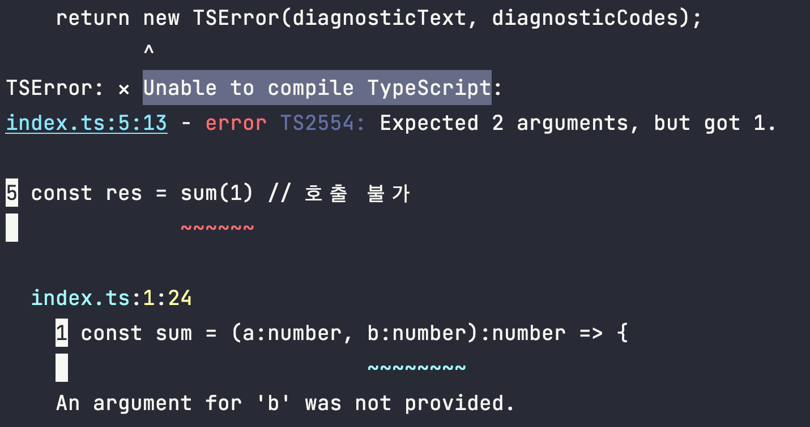

# 왜 타입스크립트를 사용하나요?

### 혹시 그렇게 생각하셨나요?
> 겨우 타입 하나 가지는데, 뭐가 다르냐고

# 안정성
제일 큰 이유는 안정성입니다. 규모가 커지고 여러 개발자와 JavaScript 개발을 진행할 수록 예상하지 못한 문제가 발생할 수 있습니다.

### 1) 파라미터 개수를 충족하지 못한경우
자바스크립트에서는 파라미터의 개수를 검사하지 않기 때문에 파라미터 개수를 맞추지 않고 호출하면 `b` 파라미터에는 `undefined`가 할당되어 결과적으로 `NaN(Not a Number)` 가 반환됩니다.
```js
const sum = (a, b) => {
    return a + b
}

const res = sum(1) // b에는 undefined가 할당됨

console.log('res', res) // NaN
```

### 2) 자료형과 맞지 않은 값을 넘겨주는 경우
의도와 전혀 다른 자료형을 넘겨주었지만, 호출하고 나서야 발견됩니다.
```js
const sum = (a, b) => {
    return a + b
}

const res = sum(1, '10') // 문자열 합성이 발생함

console.log('res', res) // 110
```

# 1. 컴파일 에러
위의 사례들은 `정적타입 언어(C, Java)`의 경우 `컴파일 단계에서 확인 가능`합니다. 다만, 자바스크립트는 애플리케이션이 실행중인 `런타임 환경`에서 확인됩니다.

만약 타입스크립트를 사용한다면 컴파일 단계에서 발견할 수 있습니다.

```ts
const sum = (a:number, b:number):number => {
    return a + b
}

const res = sum(1) // 호출 불가

console.log('res', res)
```

파라미터 b가 없어 컴파일 에러를 보여줍니다.

